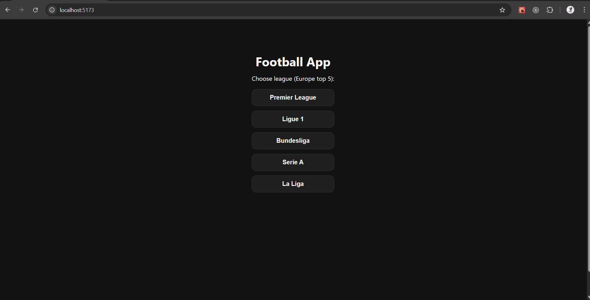
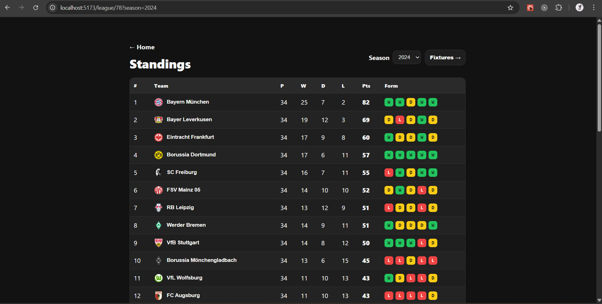
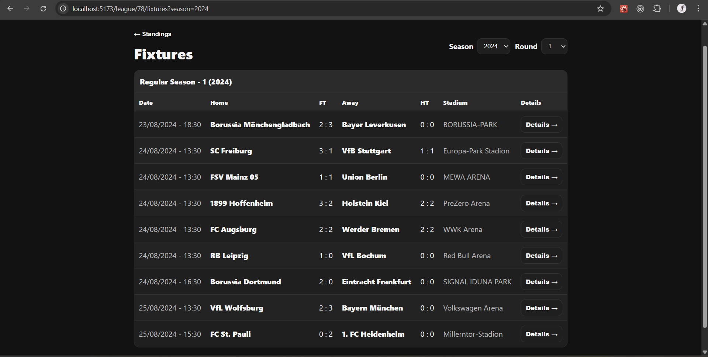
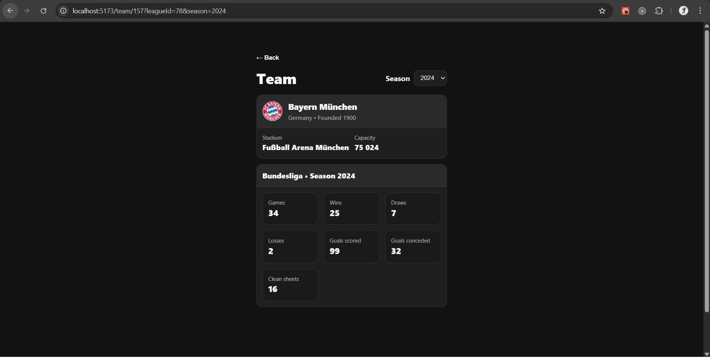
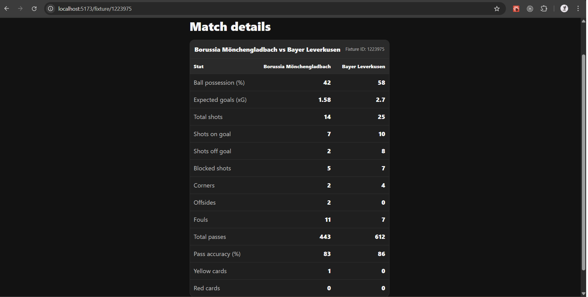

# 🏟️ Football App – Frontend

A football statistics web application built as a **portfolio project**.  
The app allows users to browse football leagues, standings, fixtures, teams, and detailed match statistics.

The main focus of this project is **clean frontend architecture**, working with real-world data, and maintaining readable, scalable UI code.

---

## ✨ Features

- Browse top European football leagues
- League standings with recent form visualization
- Fixtures by season and round
- Team details with season statistics
- Match details with advanced stats (xG, possession, shots, cards, etc.)
- Unified loading and error handling states

---

## 🧱 Tech Stack

### Frontend
- React
- TypeScript
- React Router
- CSS Modules

### Backend
- Python
- Flask
- Pydantic
- External football data API

> This repository contains the **frontend** part of the application.

---

## 📸 Screenshots

Create a folder in the root of the repository:

/screenshots

Then add screenshots and reference them below:

### Home – League Selection

### League Standings

### Fixtures

### Team Details

### Match Details

**Recommended:**
- fullscreen browser
- dark UI
- data fully loaded (no loading states)
- localhost URL is acceptable

---

## 🧠 Architecture Notes

- All components use **CSS Modules** (no inline styles)
- Styling is fully separated from business logic
- Shared helpers are extracted into a `utils` directory
- Pages are wrapped with a common layout component
- Error handling is unified via a reusable `ErrorView` component
- Tables and views are designed with scalability and readability in mind

---

## 🔗 Related Repositories

- Backend API:  
  https://github.com/wawrzyniakmateusz/football_app_backend

---

## 📌 Project Status

This project was developed as a **portfolio application**.  
Further UI refinements and feature improvements may be added in the future.

---

## 💬 Why this project?

This application was created to practice working with **real-world sports data**, routing, and complex UI states.  
The focus was not only on delivering features, but also on **code quality, maintainability, and clean project structure**.
